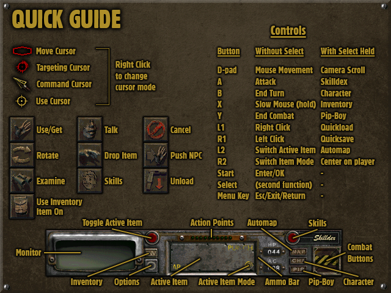

# Fallout (1997) — Miyoo Mini Plus / OnionOS Port

An unofficial port of [fallout1-ce](https://github.com/alexbatalov/fallout1-ce) (the community
re-implementation of the original Fallout) to run as a standalone OnionOS Port on the
**Miyoo Mini Plus** — a handheld with no 3D graphics acceleration.

Built on top of the work of [Alexander Batalov](https://github.com/alexbatalov/fallout1-ce) and
the SDL2 port for this hardware by [steward-fu](https://github.com/steward-fu/sdl2).

For Fallout 2, check https://github.com/cacuracaptors/fallout2-ce-miyoomini.

## ⚠️ You need your own game files

This repository does **not** include and will **never** include the Fallout data files
(`MASTER.DAT`, `CRITTER.DAT`, the `data/` folder) — they are the property of
Interplay/Bethesda. You need a legitimate copy of the game (GOG or Steam) and must copy those
files yourself. See [Installation](#installation) below.

## Features

- Runs at full speed, no overclock needed
- Software rendering (the Miyoo Mini Plus has no 3D GPU)
- A full control scheme adapted for the Miyoo Mini Plus' hardware, which has no analog sticks
  (see [Controls](#controls))
- The D-pad acts as a mouse cursor
- A custom on-device text entry system (D-pad + buttons) for naming your character, save games,
  etc., since the device has no physical keyboard
- An in-game "HELP" button in the Options menu, showing a Miyoo Mini control reference screen
  (pictured below)
- Working audio and video, including cutscenes

<p align="center">
  
  <br>
  <sub>The in-game "Quick Guide" help screen, accessible from the Options menu</sub>
</p>

## Controls

| Button | Without Select | With Select held |
|---|---|---|
| D-pad | Moves the mouse cursor | Scrolls the camera/map |
| A | Attack | Skilldex |
| B | End Turn | Character screen |
| X | Slow mouse (hold) | Inventory |
| Y | End Combat | Pip-Boy |
| L1 | Right click | Quickload (F7) |
| R1 | Left click | Quicksave (F6) |
| L2 | Switch active item | Map (Automap) |
| R2 | Switch active item's mode | Center screen on player |
| Start | Enter / confirm | — |
| Select | (modifier) | — |
| Menu Key (Function) | Esc / Menu/Return/Exit | — |

The Menu key fires Esc on **release**, not on press — this means the OnionOS Menu+Power
screenshot combo won't accidentally exit the game before you can take the screenshot.

Quicksave and Quickload have a short cooldown after firing (to avoid the underlying hardware's
key-repeat behavior from spamming save/load repeatedly). All other Select-combo actions can be
used again almost immediately.

### Typing text (character name, save names, etc.)

Since the device has no keyboard, text entry works by cycling through letters directly in the
game's own text field:

- **D-pad Up/Down**: cycles through the alphabet/numbers/space at the current position
- **D-pad Left**: toggles uppercase/lowercase for the current letter
- **D-pad Right**: inserts a space directly and moves to the next position
- **A**: confirms the current letter and moves to the next position
- **B**: deletes the last confirmed letter
- **Start**: confirms the whole text entry (Enter)
- **Menu Key (Function)**: cancels the whole text entry  (Esc)

## Installation

1. Download the latest `.zip` from the [Releases](../../releases) tab of this repository.
2. Extract its contents to the root of your OnionOS SD card.
3. Copy the following files from your legitimate Fallout installation (GOG/Steam) into `Roms/PORTS/Games/Fallout/`:
   - `MASTER.DAT`
   - `CRITTER.DAT`
   - the `data/` folder
   - `fallout.cfg` (if included with your installation)
4. On the device, open the **Ports** menu — "Fallout" should appear in the list. If not, use "refresh roms" at the bottom of the list. 

## Building from source

This port requires cross-compiling for ARMv7 hard-float using a Docker-based toolchain. Tested
on Windows + WSL2 + Docker Desktop.

### Prerequisites

- WSL2 with Ubuntu, and Docker Desktop with WSL integration enabled.

### Steps

```bash
mkdir -p ~/fallout-miyoo && cd ~/fallout-miyoo

# Cross toolchain
git clone https://github.com/shauninman/union-miyoomini-toolchain.git

# SDL2 ported for the Miyoo Mini (Plus)
git clone https://github.com/steward-fu/sdl2.git sdl2-miyoo

# This repository (already patched)
git clone https://github.com/cacuracaptors/fallout1-ce-miyoomini.git fallout1-ce
```

**1) Build the Miyoo Mini SDL2** (inside `sdl2-miyoo`, via Docker — see the
[steward-fu/sdl2](https://github.com/steward-fu/sdl2) instructions for the full
`make cfg && make gpu && make sdl2` process). No patches are needed here — this port builds
against a completely unmodified copy of `steward-fu/sdl2`.

**2) Build fallout-ce** using the cross toolchain:

```bash
cd union-miyoomini-toolchain
make shell
```

Inside the container:

```bash
cd ~/workspace/fallout1-ce

cmake -B build \
  -DCMAKE_TOOLCHAIN_FILE=toolchain-miyoomini.cmake \
  -DCMAKE_MODULE_PATH=$(pwd)/cmake \
  -DCMAKE_BUILD_TYPE=Release \
  -DSDL2_INCLUDE_DIR=/root/workspace/sdl2-miyoo/sdl2/include \
  -DSDL2_LIBRARY=/root/workspace/sdl2-miyoo/sdl2/build/.libs/libSDL2.so \
  -DCMAKE_EXE_LINKER_FLAGS="-Wl,--allow-shlib-undefined"

cmake --build build -j4
```

The final ARM (armhf) binary `fallout-ce` will be in `build/`.

### What this fork changes (compared to upstream fallout1-ce)

- **`src/movie_lib.cc`** — fixes a cutscene-corruption bug (`getOffset()` returning the wrong
  type — see [upstream PR #195](https://github.com/alexbatalov/fallout1-ce/pull/195), not merged
  at the time of this port) and adds a watchdog to the movie audio-sync loop, which otherwise
  hangs forever on this hardware.
- **`src/plib/gnw/dxinput.cc`** — makes mouse "relative mode" initialization non-fatal (this
  device's SDL2 build doesn't implement it) and adds D-pad-as-mouse-cursor movement.
- **`src/plib/gnw/input.cc`** — the full physical-button-to-game-action remapping, the
  Select-modifier layer, the on-device text entry system, and several fixes for this hardware's
  quirky key-repeat/key-up event delivery (including a bug in the engine's own
  `GNW95_process_key()` where reusing a mutated struct across a synthetic press+release pair
  could leave a key permanently "stuck" in the auto-repeat system, and makes the Menu key's Esc
  action fire on key-release instead of key-press so the OnionOS Menu+Power screenshot combo
  doesn't exit the game before Power can be pressed).
- **`src/audio_engine.cc`** — fixes an intermittent crash where the mixer callback read a full
  audio frame before checking whether the buffer's end had been reached, causing an
  out-of-bounds read when the last frame straddled the end of the buffer. Also requests 44.1 kHz
  audio output instead of 22050 Hz, which fixed a persistent, constant audio latency as a side
  effect.
- **`src/game/options.cc`** — adds a "HELP" button to the Options menu, showing `HELPSCRN.FRM`
  (an asset already present in the base game data since the original 1998 release, replaced with
  a Miyoo Mini-specific control reference), and enlarges the options menu's background art so
  all 6 buttons fit without clipping.
- **`src/game/art.cc` / `src/game/art.h`** — adds `art_find_fid_by_filename()`, a helper for
  looking up an FRM's numeric ID by name without needing to hardcode it, used to locate
  `HELPSCRN.FRM` above.
- **`src/game/gconfig.cc`** — changes the default `master_patches` folder from `data` to
  `miyoo_patches`. This repository ships a couple of small art overrides (the enlarged options
  background and the Miyoo control reference screen) in that folder; using a different name than
  `data` means they survive step 3 of [Installation](#installation), where the game's own `data`
  folder gets copied in wholesale.

## Known issues

- Intro/cutscene videos don't stretch to fill the screen (they render at their original
  resolution, centered) — the same behavior is present in the Portmaster version of this port,
  so it appears to be an inherited limitation of the original engine rather than something
  specific to this port.
- The mouse cursor moves noticeably slower on screens with an open text field (character
  creation, save/load naming).

## Changelog

- **v1.1.1** — Added an in-game "HELP" button to the Options menu, showing a Miyoo Mini control
  reference screen. Fixed the Menu key so its Esc action fires on release instead of press,
  making the OnionOS Menu+Power screenshot combo safe to use without exiting the game.
- **v1.1.0** — Fixed an intermittent crash caused by an audio buffer over-read. Fixed a
  persistent, constant audio latency by requesting 44.1 kHz audio output instead of 22050 Hz.
- **v1.0.0** — Initial release.

## Credits

- [Alexander Batalov](https://github.com/alexbatalov) — fallout1-ce
- [steward-fu](https://github.com/steward-fu) — SDL2 for the Miyoo Mini (Plus)
- [shauninman](https://github.com/shauninman) — union-miyoomini-toolchain
- Interplay Entertainment / Black Isle Studios — the original Fallout (1997)

## License

This port's source code follows the same license as fallout1-ce: the **Sustainable Use License**
(see `LICENSE.md`). Use and distribution are free for non-commercial purposes, provided the
original copyright notices are kept intact.
