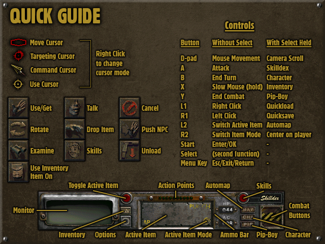

# Fallout (1997) — Miyoo Mini Plus / OnionOS Port

An unofficial port of [fallout1-ce](https://github.com/alexbatalov/fallout1-ce) (the community
re-implementation of the original Fallout) to run as a standalone OnionOS Port on the
**Miyoo Mini Plus** — a handheld with no 3D graphics acceleration.

Built on top of the work of [Alexander Batalov](https://github.com/alexbatalov/fallout1-ce) and
the SDL2 port for this hardware by [steward-fu](https://github.com/steward-fu/sdl2).

For Fallout 2, check https://github.com/cacuracaptors/fallout2-ce-miyoomini.

## ⚠️ You need your own game files

This repository does **not** include and will **never** include the Fallout data files
(`MASTER.DAT`, `CRITTER.DAT`, the `data/` folder) — they are the property of
Interplay/Bethesda. You need a legitimate copy of the game (GOG or Steam) and must copy those
files yourself. See [Installation](#installation) below.

## Features

- Runs at full speed, no overclock needed
- Software rendering (the Miyoo Mini Plus has no 3D GPU)
- A full control scheme adapted for the Miyoo Mini Plus' hardware, which has no analog sticks
  (see [Controls](#controls))
- The D-pad acts as a mouse cursor
- A custom on-device text entry system (D-pad + buttons) for naming your character, save games,
  etc., since the device has no physical keyboard
- An in-game "HELP" button in the Options menu, showing a Miyoo Mini control reference screen
  (pictured below)
- Working audio and video, including cutscenes
- Saves automatically when you turn the device off, and picks up right where you left off
  the next time you turn it on (see [Turning the device off](#turning-the-device-off-save-and-resume))

<p align="center">
  
  <br>
  <sub>The in-game "Quick Guide" help screen, accessible from the game's menu</sub>
</p>

## Controls

| Button | Without Select | With Select held |
|---|---|---|
| D-pad | Moves the mouse cursor | Scrolls the camera/map |
| A | Attack | Skilldex |
| B | End Turn | Character screen |
| X | Slow mouse (hold) | Inventory |
| Y | End Combat | Pip-Boy |
| L1 | Right click | Quickload (F7) |
| R1 | Left click | Quicksave (F6) |
| L2 | Switch active item | Map (Automap) |
| R2 | Switch active item's mode | Center screen on player |
| Start | Enter / confirm / End Combat | — |
| Select | (modifier) | — |
| Menu Key (Function) | Esc / Menu/Return/Exit | — |

The Menu key fires Esc on **release**, not on press — this means the OnionOS Menu+Power
screenshot combo won't accidentally exit the game before you can take the screenshot.

Quicksave and Quickload have a short cooldown after firing (to avoid the underlying hardware's
key-repeat behavior from spamming save/load repeatedly). All other Select-combo actions can be
used again almost immediately.

### Typing text (character name, save names, etc.)

Since the device has no keyboard, text entry works by cycling through letters directly in the
game's own text field:

- **D-pad Up/Down**: cycles through the alphabet/numbers/space at the current position
- **D-pad Left**: toggles uppercase/lowercase for the current letter
- **D-pad Right**: inserts a space directly and moves to the next position
- **A**: confirms the current letter and moves to the next position
- **B**: deletes the last confirmed letter
- **Start**: confirms the whole text entry (Enter)
- **Menu Key (Function)**: cancels the whole text entry  (Esc)

## Installation

1. Download the latest `.zip` from the [Releases](../../releases) tab of this repository.
2. Extract its contents to the root of your OnionOS SD card.
3. Copy the following files from your legitimate Fallout installation (GOG/Steam) into `Roms/PORTS/Games/Fallout/`:
   - `MASTER.DAT`
   - `CRITTER.DAT`
   - the `data/` folder
4. On the device, open the **Ports** menu — "Fallout" should appear in the list. If not, use "refresh roms" at the bottom of the list.

> **Important:** do not copy `fallout.cfg` from your PC installation. If you already did, delete it:
> the game creates its own on first launch. A PC `fallout.cfg` overrides this port's settings and
> breaks the in-game HELP screen.

## Turning the device off (save and resume)

Turn the device off with the power button, as usual, while playing: the game saves your progress
and OnionOS powers off right after. The next time you turn the device on, the game starts by
itself and loads that save directly, skipping the intro and the main menu.

- The power-off save goes into its own hidden slot (`SAVEGAME/MIYOO01`). It never replaces one of
  your save slots and does not appear on the Load screen. It is loaded only once, so keep saving
  normally as well.
- It saves only where the original game lets you save: on the map, and on your turn in combat.
  Open windows (inventory, Pip-Boy, character screen, menus) are closed first, as if you pressed
  the Menu key (so points not yet confirmed on the character screen are discarded). During an
  enemy's turn or a scripted scene, the game waits for it to finish.
- In a conversation, on the world map or in the main menu, the game just closes without saving,
  as before.
- Hold the Menu key while turning the device on to go to the OnionOS menu instead: the game will
  still pick up from the power-off save the next time you open it.
- A forced shutdown (holding the power button for about 10 seconds) does not save.

## Changelog

- **v1.2.0** — Save on power off: turning the device off with the power button while playing
  now saves your progress in a separate, hidden slot (it never replaces your own saves), and
  the next time you turn the device on the game starts by itself and picks up right where you
  left off, skipping the intro and the main menu. It saves on the map and on your turn in
  combat: open windows (inventory, Pip-Boy, menus) are closed first, and enemy turns and
  scripted scenes are waited for. In a conversation or on the world map the game closes without
  saving, as before.
- **v1.1.5** — The D-pad mouse cursor now moves at the same speed on every screen: it is no
  longer slower on screens with a text field (character creation, save names, etc.) or in busy
  maps. Lower CPU use, and so better battery life, in dialogs, the Pip-Boy, the world map, the
  save/load screens and the character screen: the game no longer keeps a CPU core busy while it
  waits between frames.
- **v1.1.4** — Fixed the not so rare crash when skipping videos and dialog audio quickly (the sound
  engine's thread locks were not working on this device). Lower CPU use, and so better battery
  life, on menus, dialogs, the inventory, the world map and most maps: the screen is only
  redrawn when something changes, color cycling (water, fire, monitors) no longer forces
  full-screen redraws when none of those colors are on screen, and audio mixing is about 10x
  lighter. Map and save loading is also much faster.
- **v1.1.3** — Fixed buttons (notably Start and Select) sometimes ignoring presses,
  especially in long sessions. Crash reports (crash_log.txt) now show exactly where a
  crash happened.
- **v1.1.2** — Updated the in-game Quick Guide help screen with the on-device text entry
  controls. Updated the installation instructions: `fallout.cfg` should no longer be copied from a
  PC installation, since it overrides this port's settings and breaks the HELP screen. Added a
  crash logger: if the game crashes, it writes a `crash_log.txt` file to the game folder, which
  helps a lot when reporting the problem.
- **v1.1.1** — Added an in-game "HELP" button to the Options menu, showing a Miyoo Mini control
  reference screen. Fixed the Menu key so its Esc action fires on release instead of press,
  making the OnionOS Menu+Power screenshot combo safe to use without exiting the game.
- **v1.1.0** — Fixed an intermittent crash caused by an audio buffer over-read. Fixed a
  persistent, constant audio latency by requesting 44.1 kHz audio output instead of 22050 Hz.
- **v1.0.0** — Initial release.

## Building from source

This port requires cross-compiling for ARMv7 hard-float using a Docker-based toolchain. Tested
on Windows + WSL2 + Docker Desktop.

### Prerequisites

- WSL2 with Ubuntu, and Docker Desktop with WSL integration enabled.

### Steps

```bash
mkdir -p ~/fallout-miyoo && cd ~/fallout-miyoo

# Cross toolchain
git clone https://github.com/shauninman/union-miyoomini-toolchain.git

# SDL2 ported for the Miyoo Mini (Plus)
git clone https://github.com/steward-fu/sdl2.git sdl2-miyoo

# This repository (already patched)
git clone https://github.com/cacuracaptors/fallout1-ce-miyoomini.git fallout1-ce
```

**1) Build the Miyoo Mini SDL2** (inside `sdl2-miyoo`, via Docker — see the
[steward-fu/sdl2](https://github.com/steward-fu/sdl2) instructions for the full
`make cfg && make gpu && make sdl2` process). No patches are needed here — this port builds
against a completely unmodified copy of `steward-fu/sdl2`.

**2) Build fallout-ce** using the cross toolchain:

```bash
cd union-miyoomini-toolchain
make shell
```

Inside the container:

```bash
cd ~/workspace/fallout1-ce

cmake -B build \
  -DCMAKE_TOOLCHAIN_FILE=toolchain-miyoomini.cmake \
  -DCMAKE_MODULE_PATH=$(pwd)/cmake \
  -DCMAKE_BUILD_TYPE=Release \
  -DSDL2_INCLUDE_DIR=/root/workspace/sdl2-miyoo/sdl2/include \
  -DSDL2_LIBRARY=/root/workspace/sdl2-miyoo/sdl2/build/.libs/libSDL2.so \
  -DCMAKE_EXE_LINKER_FLAGS="-Wl,--allow-shlib-undefined"

cmake --build build -j4
```

The final ARM (armhf) binary `fallout-ce` will be in `build/`.

### What this fork changes (compared to upstream fallout1-ce)

- **`src/movie_lib.cc`** — fixes a cutscene-corruption bug (`getOffset()` returning the wrong
  type — see [upstream PR #195](https://github.com/alexbatalov/fallout1-ce/pull/195), not merged
  at the time of this port) and adds a watchdog to the movie audio-sync loop, which otherwise
  hangs forever on this hardware.
- **`src/plib/gnw/dxinput.cc`** — makes mouse "relative mode" initialization non-fatal (this
  device's SDL2 build doesn't implement it) and adds D-pad-as-mouse-cursor movement.
  The cursor moves at a fixed speed in pixels per second (like a real mouse), so it is no
  longer slower on the 24 fps text entry screens.
- **`src/plib/gnw/input.cc`** — the full physical-button-to-game-action remapping, the
  Select-modifier layer, the on-device text entry system, and several fixes for this hardware's
  quirky key-repeat/key-up event delivery (including a bug in the engine's own
  `GNW95_process_key()` where reusing a mutated struct across a synthetic press+release pair
  could leave a key permanently "stuck" in the auto-repeat system, and makes the Menu key's Esc
  action fire on key-release instead of key-press so the OnionOS Menu+Power screenshot combo
  doesn't exit the game before Power can be pressed).
- **`src/audio_engine.cc`** — fixes an intermittent crash where the mixer callback read a full
  audio frame before checking whether the buffer's end had been reached, causing an
  out-of-bounds read when the last frame straddled the end of the buffer. Also requests 44.1 kHz
  audio output instead of 22050 Hz, which fixed a persistent, constant audio latency as a side
  effect. The mixer also converts 32 sample frames per call instead of one, which makes it
  about 10x lighter.
- **`CMakeLists.txt`** — links the game directly to `libpthread`. On this device's older glibc
  (2.28) the thread library is separate from libc, and without a direct link every `std::mutex`
  lock in the game silently did nothing, letting the audio and main threads corrupt each other's
  memory (the crash when skipping videos).
- **`src/plib/gnw/svga.cc`, `src/int/movie.cc`** — only presents a new frame when something on
  screen changed (and at least every 250 ms), and skips the full-screen palette conversion when
  color cycling changes colors that are not on screen. Partial texture uploads are not used:
  this device's SDL2 renderer ignores the position of a partial update.
- **`src/plib/gnw/svga.cc`** — when the renderer is recreated after a window size change
  (this device sends one at startup), the current screen is copied into the new texture.
  Upstream leaves it black, and only the parts redrawn afterwards show up.
- **`src/miyoo_shutdown.cc`, `src/plib/gnw/winmain.cc`, `src/game/main.cc`, `src/game/game.cc`,
  `src/plib/gnw/input.cc`, `src/game/loadsave.cc`** — save on power off and resume on the
  next boot (OnionOS only). The game watches OnionOS's off order (`/tmp/.offOrder`, which is
  created even when OnionOS does not send the game a SIGTERM) and SIGTERM, closes open windows
  with Esc, and saves from the same place where the quick save key works, into a separate slot
  folder (`SAVEGAME\MIYOO01`, via a slot folder prefix in `loadsave.cc`). It then puts back
  OnionOS's `cmd_to_run.sh`, so OnionOS launches the game again on boot, and the next launch
  loads that save through the main menu's load path, skipping the intro movies and the menu.
  A small script in `.tmp_update/checkoff` (removed when the game closes normally) makes
  OnionOS wait up to 20 s for the save.
- **`src/plib/gnw/input.cc`, `src/plib/gnw/vcr.cc`, `src/game/*.cc`** — the original code waited
  between frames in empty busy-wait loops that kept a CPU core at 100%. Those 39 loops (and
  `pause_for_tocks()` / `block_for_tocks()`) now sleep while waiting and end at the same moment
  as before, so animation speeds do not change.
- **`src/game/options.cc`** — adds a "HELP" button to the Options menu, showing `HELPSCRN.FRM`
  (an asset already present in the base game data since the original 1998 release, replaced with
  a Miyoo Mini-specific control reference), and enlarges the options menu's background art so
  all 6 buttons fit without clipping.
- **`src/game/art.cc` / `src/game/art.h`** — adds `art_find_fid_by_filename()`, a helper for
  looking up an FRM's numeric ID by name without needing to hardcode it, used to locate
  `HELPSCRN.FRM` above.
- **`src/crash_handler.cc`, `src/plib/gnw/winmain.cc`** — installs a signal handler that writes a
  backtrace to `crash_log.txt` when the game crashes, so crashes during normal play can be
  diagnosed later with `addr2line`.
- **`src/game/gconfig.cc`** — changes the default `master_patches` folder from `data` to
  `miyoo_patches`. This repository ships a couple of small art overrides (the enlarged options
  background and the Miyoo control reference screen) in that folder; using a different name than
  `data` means they survive step 3 of [Installation](#installation), where the game's own `data`
  folder gets copied in wholesale.

## Credits

- [Alexander Batalov](https://github.com/alexbatalov) — fallout1-ce
- [steward-fu](https://github.com/steward-fu) — SDL2 for the Miyoo Mini (Plus)
- [shauninman](https://github.com/shauninman) — union-miyoomini-toolchain
- Interplay Entertainment / Black Isle Studios — the original Fallout (1997)

## License

This port's source code follows the same license as fallout1-ce: the **Sustainable Use License**
(see `LICENSE.md`). Use and distribution are free for non-commercial purposes, provided the
original copyright notices are kept intact.
